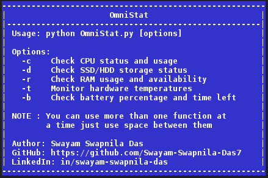

[](https://git.io/typing-svg)

## Overview
A lightweight CLI tool to monitor system resources (CPU, RAM, Storage, Temperature, and Battery) using Python and `psutil`,`sys`.


## Features
<ul>
<li> CPU Status: Monitor core count and excessive load.</li>
<li> Disk Status: Check total, used, and free storage space.</li>
<li> RAM Status: Track memory usage and availability.</li>
<li> Hardware Temperature: Monitor CPU, NVMe SSD, and GPU temperatures.</li>
<li> Battery Status: View charge percentage, remaining time, and power state.</li>
</ul>

## Installation & Setup

### 1. Clone the repository

```bash
git clone https://github.com/Swayam-Swapnila-Das7/OmniStat.git

```

### 2. Move inside to the script directory
```bash
cd OmniStat

```

### 3. Create a virtual environment (Recommended)

```bash
python -m venv myenv

```

### 4. Activate the created virtual environment
```bash
source myenv/bin/activate  # On Windows use: myenv\Scripts\activate

```

### 5. Install dependencies

```bash
pip install -r requirements.txt

```

## 6.Usage

Run the script from your terminal with one or more options:

```bash
python OmniStat.py [options]

```
or Run this command to open help menu
```bash
python OmniStat.py

```
---

### Options

* `-c` : Check CPU status and usage
* `-d` : Check SSD/HDD storage status
* `-r` : Check RAM usage and availability
* `-t` : Monitor hardware temperatures
* `-b` : Check battery percentage and time left

*Note: You can use more than one function at a time just by adding a space between them (e.g., `python OmniStat.py -c -r`).*

---
### Example outputs for each funtion
### To open help Menu
```console
$ python OmniStat.py

    ------------------------------------------------------
    |                     OmniStat                       |
    |----------------------------------------------------|
    | Usage: python OmniStat.py [options]                |
    |                                                    |
    | Options:                                           |
    |   -c    Check CPU status and usage                 |
    |   -d    Check SSD/HDD storage status               |
    |   -r    Check RAM usage and availability           |
    |   -t    Monitor hardware temperatures              |
    |   -b    Check battery percentage and time left     |
    |                                                    |
    | NOTE : You can use more than one function at       |
    |        a time just use space between them          |
    |                                                    |
    | Author: Swayam Swapnila Das                        |
    | GitHub: https://github.com/Swayam-Swapnila-Das7    |
    | LinkedIn: in/swayam-swapnila-das                   |
    ------------------------------------------------------


```


### To check CPU details
```console
$ python OmniStat.py -c

=========== CPU STATUS ===========

[+]Your CPU have 4 cores.
[SAFE] Your CPU is working in safe limit.
 Running at 2.40 %
```
### To check SSD usage
```console
$ python OmniStat.py -d


=========== SSD/HDD STORAGE STATUS ===========

 Total Partitions found : 2
 Checking for partition : /
 Total Space : 467.89 GiB
 Used Space : 10.37 GiB
 Free Space : 433.69 GiB
 [SAFE] You have good enough storage .
  Your disk in '/' is 2.30 % used .
 Checking for partition : /boot/efi
 Total Space : 0.50 GiB
 Used Space : 0.10 GiB
 Free Space : 0.40 GiB
 [SAFE] You have good enough storage .
  Your disk in '/boot/efi' is 20.00 % used .
```
#### Note
<ul>
    <li>Due to some system level restrictions,the usage reported for the '/boot/efi' partition(or any other partitions) may not be completely accurate.</li>
</ul>

### To check RAM status(including swap memory)
```console
$ python OmniStat.py -r


=========== RAM STATUS ===========

 Total RAM : 7.01 GiB
 Used RAM : 1.51 GiB
 Available RAM : 5.50 GiB
 [SAFE] You have good enough RAM .
  Your RAM is 21.50% used .


 Swap Memory also found
 ----------------------
 Total SWAP : 2.00 GiB
 Used RAM : 0.00 GiB
 Available RAM : 2.00 GiB
 [SAFE] You have good enough SWAP RAM .
  Your RAM is 0.00% used .
```
#### Note
<ul>
    <li>It can also check for swap memory, if it is configured on the system. </li>
</ul>

### To check temperature of Hardwares(CPU,MOTHERBOARD,SSD,GPU)
```console
$ python OmniStat.py -t 


=========== HARDWARE TEMPERATURE MONITOR ===========

[+] CPU CORE TEMPERATURE :
      Label   Temperature
      -----   -----------
      Tctl   37.25 °C

[+] MOTHERBOARD(CPU Socket) TEMPERATURE :
      Label   Temperature
      -----   -----------
      BOARD   36.00 °C
      BOARD   20.00 °C

[+] NVMe SSD TEMPERATURE :
      Label   Temperature
      -----   -----------
      Composite   32.85 °C
      Sensor 1   32.85 °C

[+]GPU CORE TEMPERATURE :
      Label   Temperature
      -----   -----------
      edge   36.00 °C
```
#### Note
<ul>
    <li>This function is completely depends on system-level permissions.</li>
    <li>It also depends on hardware specifications, such as `CPU`,`MotherBoard`,`SSD`,`GPU`.</li>
    <li>The 'motherboard' temperature reading refers to the are where the CPU heat dissipates,typically the space immediately surrounding the CPU socket and its heatsink.</li>
</ul>

### To check battery status
```console
$ python OmniStat.py -b


=========== BATTERY STATUS CHECK ===========
  CHARGE : 91.03 %
  TIME LEFT : 15:5:8
  POWER PLUGGED STATUS : DISCHARGING
```
#### Note
<ul>
    <li>The TIME LEFT value is not strictly accurate; it is mereley an estimate generated by the function. In real-world usage, the actual time will vary.</li>
</ul>

### To use multiple function at once
<ul>
    <li>You can pass multiple arguments by separating them with a space(e.g., python OmniStat.py -c -t -d ).</li>
</ul>


### File Structure
```text
OmniStat/
├── core/
│   ├── __init__.py
│   └── scan.py
│
├── statics/
├── .gitignore
├── LICENSE
├── requirements.txt        
├── OmniStat.py
└── README.md
```

## Hardware Compatibility & Testing
<p>
    I originally built and tested this project on Void Linux using an AMD Ryzen 5 CPU,an integrated AMD RADEON GPU, an NVMe SSD, and an HP motherboard.
</p>
<p>
    I want to expand this project to be compatible with a wider variety of wardware. If you encounter any issues running this code on your system, please share them in the project's Discussion section! You can greatly help improve this tool by sharing the Output of your<br>
    ```bash
    psutil.sensors_temperatures(fahrenheit=False)
    ```
    command there,which will allow me to enhance the script to support your specific system configuration.
</p>

## Author
<ul>
    <li><b>Swayam Swapnila Das</b></li>
    <li>GitHUB: <a href="https://github.com/Swayam-Swapnila-Das7">Swayam-Swapnila-Das7</a></li>
    <li>LinkedIn: <a href="https://www.google.com/search?q=https://linkedin.com/in/swayam-swapnila-das">swayam-swapnila-das</a></li>
    <li>TryHackMe: <a href="https://tryhackme.cpm/p/0xSwayam">0xSwayam</a></li>

</ul>
